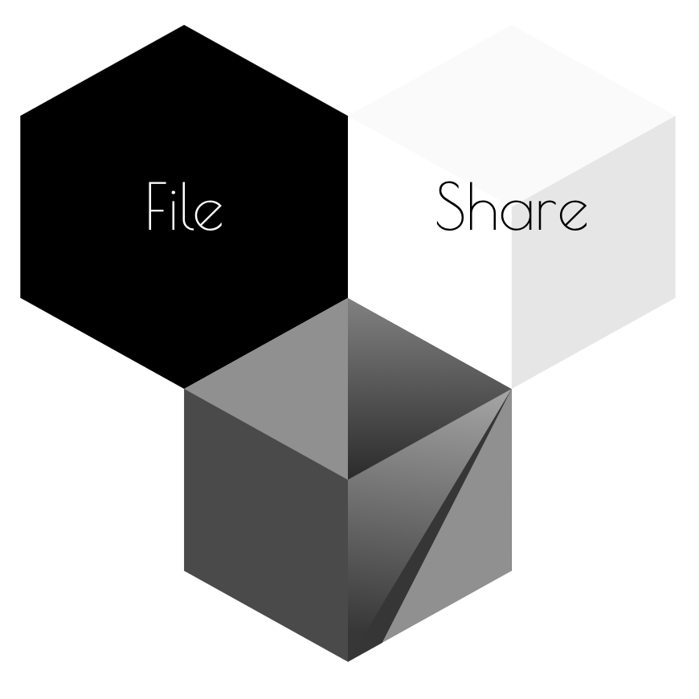
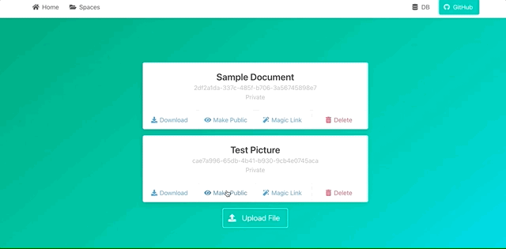

<!-- PROJECT LOGO -->
 

    
  <h3 align="center">Private File Upload</h3>

  

    Build on Spring Cloud & AWS S3
  

<!-- TABLE OF CONTENTS -->
## Table of Contents

* [About the Project](#about-the-project)
  * [Built With](#built-with)
* [Getting Started](#getting-started)
  * [Prerequisites](#prerequisites)
  * [Installation](#installation)
* [Usage](#usage)
* [Contact](#contact)
* [Acknowledgements](#acknowledgements)

<!-- ABOUT THE PROJECT -->
## About The Project

          

### Built With
- Spring Boot
- Spring Cloud
- AWS S3
- ☕️ & ❤️

<!-- GETTING STARTED -->
## Getting Started

### Prerequisites

In order to run this application you should have an Amazon Web Services (AWS) account.

### Installation

1. Update the `application.yaml` settings value for `cloud.aws.credentials.profile-name` to the name of your local AWS-profile
2. run `./gradlew bootRun`
3. Open your browser at `localhost:8080`

<!-- USAGE EXAMPLES -->
## Usage

The application wraps a lot of S3-related API calls in easy to use UI elements to

- create/delete buckets (mapped as "spaces" so we can give them non-unique names)
- upload/delete files
- make files public/private
- create pre-signed URLs for files
- create bucket policy rules to set the lifecycle duration for elements

More detailed instructions can be found here:

  
🪣 Create a bucket

  
1. Navigate to the _Spaces_ section
2. Click on _New Space_ 
3. Enter the name and click _Submit_ 
4. A message should pop up to indicate success

  
🗂 Upload a File

  
1. Navigate to the _Spaces_ section
2. Select _Details_ on the target Space/Bucket
3. Click on _Upload File_
4. Pick our file, provide a name and click _Submit_
5. A message should pop up to indicate success 

  
🔎 List all Objects in a Bucket

  
1. Navigate to the _Spaces_ section
2. Select _Details_ on the target Space/Bucket
3. You see a list of all objects stored in the bucket 

  
🌐 Get an Object's URL

  
1. Navigate to the _Spaces_ section
2. Select _Details_ on the target Space/Bucket
3. Select _Download_ on the target object
4. The object's URL shall be opened in a new tab

  
📢 Make an object public

  
1. Navigate to the _Spaces_ section
2. Select _Details_ on the target Space/Bucket
3. Select _Make Public_ on the target object
4. A message should pop up to indicate success

  
🤫 Make an Object private

  
1. Navigate to the _Spaces_ section
2. Select _Details_ on the target Space/Bucket
3. Select _Make Private_ on the target object
4. A message should pop up to indicate success 

  
🔥 Delete an Object

1. Navigate to the _Spaces_ section
2. Select _Details_ on the target Space/Bucket
3. Select _Delete_ on the target object
4. The list of objects should reload without the deleted one 

  
☄️ Delete a Bucket

  
1. Navigate to the _Spaces_ section
2. Select _Delete_ on the target Space/Bucket
3. The list of buckets should reload without the deleted one 

  
👾 Generate a pre-signed URL

  
1. Navigate to the _Spaces_ section
2. Select _Details_ on the target Space/Bucket
3. Select _Magic Link_ on the target object
4. A message should pop up, containing a pre-signed URL for that object (which is valid for 15 minutes) 

  
⏳ Set Expiration on Bucket

1. Navigate to the _Spaces_ section
2. Select _Make Temporary_ on the target Space/Bucket
3. Select _Delete_ on the target object
4. A message should pop up to indicate success 

<!-- CONTACT -->
## Contact

Joshua Görner - [jgoerner](https://www.linkedin.com/in/jgoerner/) - joshua.goerner[at]gmail.com

<!-- ACKNOWLEDGEMENTS -->
## Acknowledgements
* [O. Drew](https://github.com/othneildrew/Best-README-Template) - nice GH Readme template
* [Hatchful](https://hatchful.shopify.com/) - Easy Logo Generation