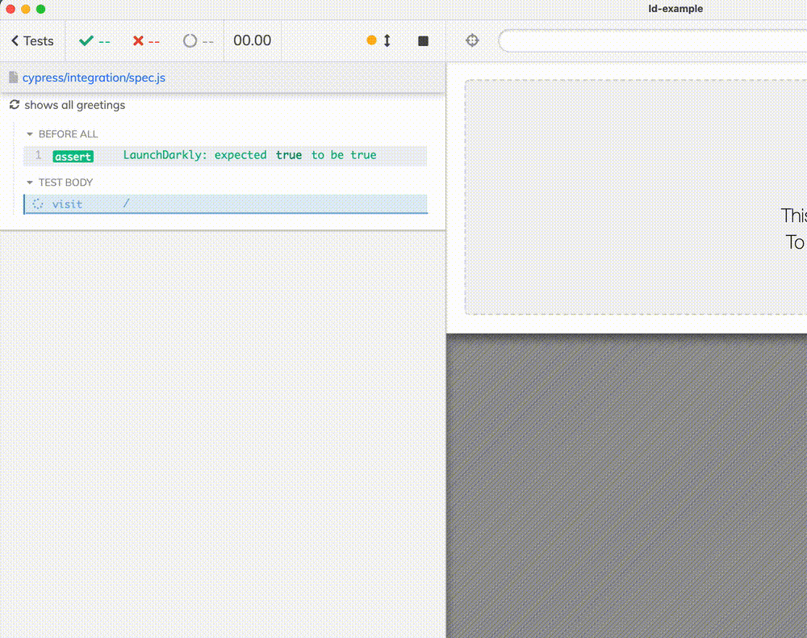

# cypress-ld-control-example  [](https://github.com/bahmutov/cypress-ld-control-example/actions/workflows/ci.yml)

> Example app that uses LaunchDarkly and tests the feature flags using Cypress

Read the blog post [Control LaunchDarkly From Cypress Tests](https://glebbahmutov.com/blog/cypress-and-launchdarkly/) and use [cypress-ld-control](https://github.com/bahmutov/cypress-ld-control).



The original app was copied from the official LaunchDarkly React example with commands:

```
$ npx degit launchdarkly/react-client-sdk/examples/hoc cypress-ld-control-example
> cloned launchdarkly/react-client-sdk#HEAD to cypress-ld-control-example
```
