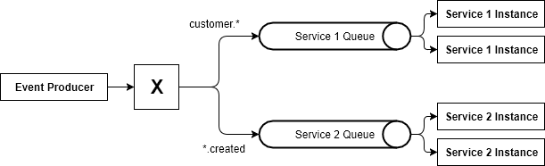

# Event Brokering with Spring Boot and RabbitMQ
 
This application implements an Event mechanism usable in Microservice environments. 

## Companion Blog Article
The companion blog article to this repository can be found [here](https://reflectoring.io/event-messaging-with-spring-boot-and-rabbitmq/).

## Scenario

* a publisher publishes events with one of these topics
  * customer.created
  * customer.edited
  * customer.deleted
  * order.created
  * order.edited
  * order.deleted
  * invoice.created
  * invoice.edited
  * invoice.deleted
* a subscriber subscribes to events of a specific topic from 
  a queue specific to its (micro-)service 
  

## Usage

1. [Install RabbitMQ](https://www.rabbitmq.com/download.html) (if it's installed on another
host than localhost then you need to change the connection properties in `application.properties`)
1. start a couple instances of the demo application in `subscriber` mode, for example:
   * `./gradlew bootrun -Dspring.profiles.active=subscriber -Dsubscriber.queue=service1Queue -Dsubscriber.routingKey=customer.*`
   * `./gradlew bootrun -Dspring.profiles.active=subscriber -Dsubscriber.queue=service2Queue -Dsubscriber.routingKey=.*created`
   * `./gradlew bootrun -Dspring.profiles.active=subscriber -Dsubscriber.queue=service3Queue -Dsubscriber.routingKey=*.*`
1. start a single instance of the demo application in `publisher` mode:
   * `./gradlew bootrun -Dspring.profiles.active=publisher`
1. check the log output of the publisher and the subscribers to see which events are produced and which events
   are consumed by each subscriber

